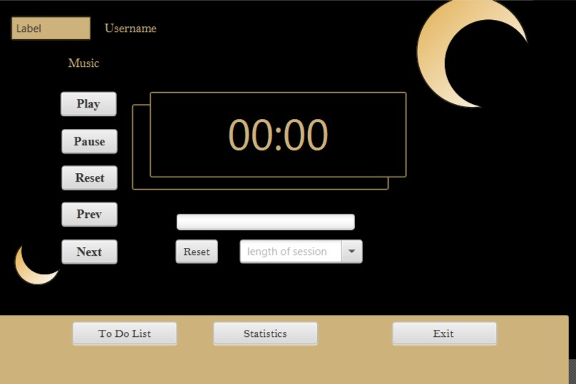

# Study Partner Desktop Application 📚🧑‍🤝‍🧑

Study Partner is a desktop application built with Java to enhance your study experience. It provides a range of features designed to help you stay focused, organized, and motivated while studying.

## Features 💫

1. **Sign-Up and User Authentication:**
   - Create a new account and securely log in to the application.
   - Personalize your profile with a username and profile picture.
   

2. **Statistics:**
   - Track your study time and view detailed statistics on your productivity and progress.
   

3. **To-Do List:**
   - Create and manage your study tasks with due dates and priorities.
   - Categorize tasks into different subjects or topics for better organization.
   - Mark tasks as completed when finished to track your progress.
   
   
4. **Study Music and Pomodoro Timer:**
   - Access a collection of ambient and instrumental music tracks to create a conducive study environment.
   - Choose from different genres or playlists to suit your preferences.
   - Control the music playback directly from the application.
    

